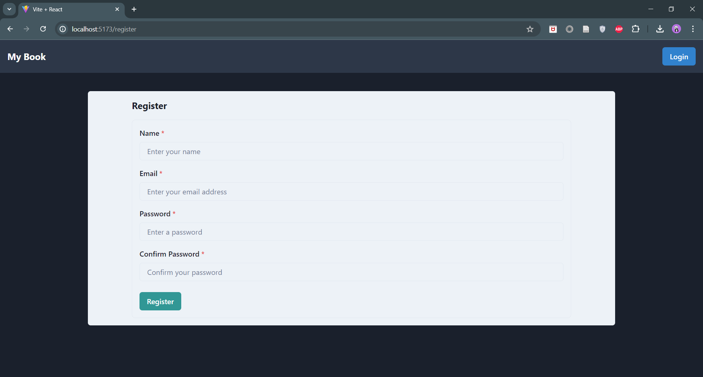

# Simple Book Store

## Table of contents

- [Overview](#overview)
  - [The challenge](#the-challenge)
  - [Documentation](#documentation)
  - [Links](#links)
- [My process](#my-process)

## Overview

### The challenge

- Penggunaan react router
- Melakukan http request ( Get, post, delete, put ) 
- Melakukan file handling ( Upload file )
- Memahami Authentikasi

### Documentation

### Links

- backend
- frontend

## My process

- Run project backend, dan baca dokumentasi yang telah disediakan.
- Selesaikan features yang diminta
- Setup api menggunakan gitlab CI/CD
- Berikan sentuhan UI yang menarik. 
